# TT-Pro Architecture Design Document

## Document Information

- **Project**: TT-Pro (Time Trial Pro)
- **Version**: 1.0.0
- **Last Updated**: 2026-01-08
- **Status**: Active Development

---

## Table of Contents

1. [System Overview](#system-overview)
2. [Architecture Patterns](#architecture-patterns)
3. [System Architecture](#system-architecture)
4. [Component Architecture](#component-architecture)
5. [Data Flow](#data-flow)
6. [Technology Stack](#technology-stack)
7. [Deployment Architecture](#deployment-architecture)
8. [Security Architecture](#security-architecture)
9. [Scalability & Performance](#scalability--performance)
10. [Future Architecture Evolution](#future-architecture-evolution)

---

## System Overview

TT-Pro is a comprehensive cycling time trial analysis platform that combines:
- **Fitness Tracking**: Training load management and FTP monitoring
- **Aero Analysis**: Computer vision-based position analysis
- **Race Strategy**: AI-powered race planning using Google Gemini

### Design Philosophy

- **Progressive Enhancement**: Start with client-side MVP, evolve to full-stack
- **AI-First**: Leverage AI for insights and recommendations
- **Real-time Feedback**: Immediate visual feedback on training and aero data
- **Modular Design**: Independent modules that can be developed/deployed separately

---

## Architecture Patterns

### Current Pattern: Modular Monolith (Client-Side)

The application currently follows a **Modular Monolith** pattern entirely on the client side, designed for easy transition to microservices.

**Characteristics**:
- Self-contained feature modules (Fitness, Aero, Strategy)
- Shared UI components and utilities
- Direct API integration with Google Gemini
- Local state management per module

### Future Pattern: Backend-for-Frontend (BFF)

Future architecture will introduce a BFF layer:
- Node.js/Express backend
- API Gateway pattern
- Separate microservices for compute-intensive tasks

---

## System Architecture

### High-Level Architecture Diagram

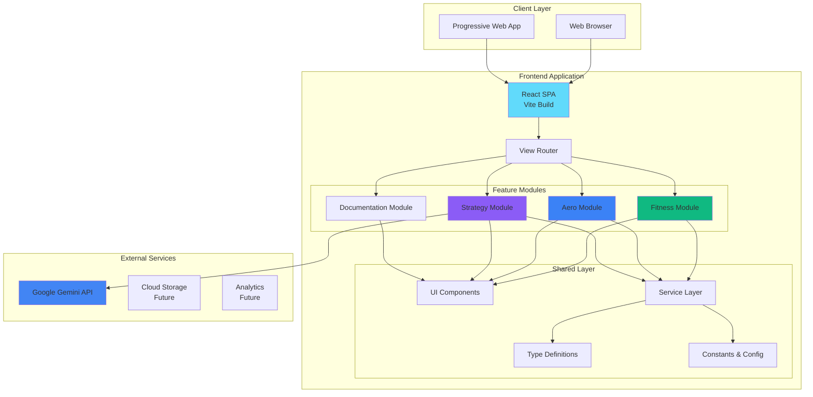

### Current Architecture (Phase 1 - MVP)

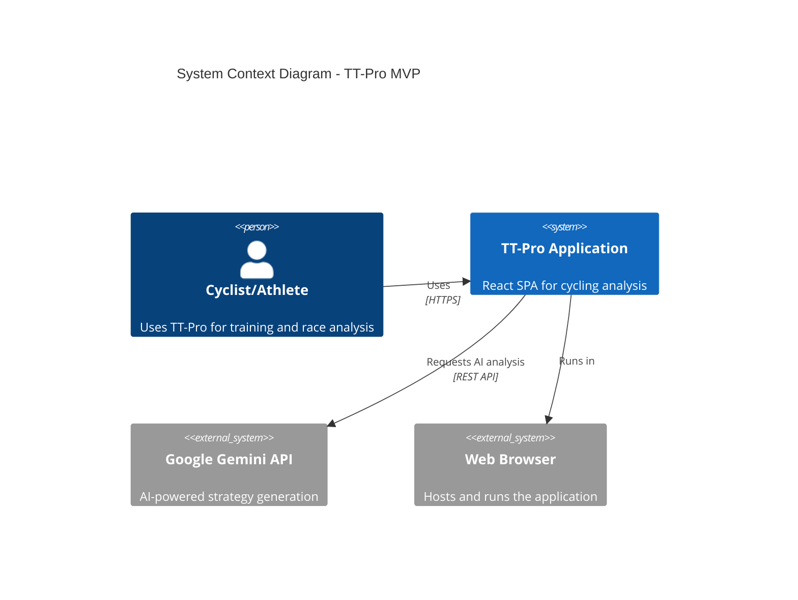

---

## Component Architecture

### Component Hierarchy

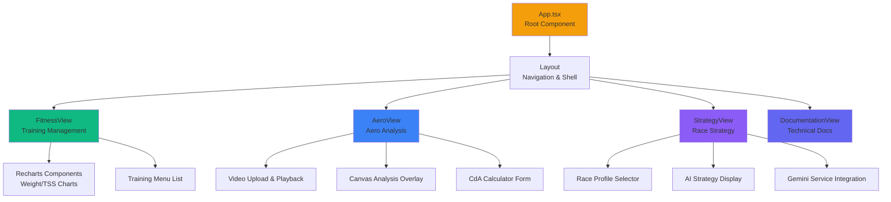

### Module Structure

```
TT-Pro/
├── App.tsx                 # Root component & routing
├── index.tsx               # Application entry point
├── components/             # Feature modules
│   ├── Layout.tsx          # Main layout & navigation
│   ├── FitnessView.tsx     # Fitness tracking module
│   ├── AeroView.tsx        # Aero analysis module
│   ├── StrategyView.tsx    # Strategy planning module
│   └── DocumentationView.tsx # Documentation viewer
├── services/               # Business logic layer
│   └── geminiService.ts    # AI service integration
├── types.ts                # TypeScript type definitions
├── constants.ts            # App constants & mock data
├── vite.config.ts          # Build configuration
└── docs/                   # Technical documentation
    ├── database-schema.md
    ├── api-design.md
    ├── architecture.md
    └── ...
```

---

## Data Flow

### Training Data Flow

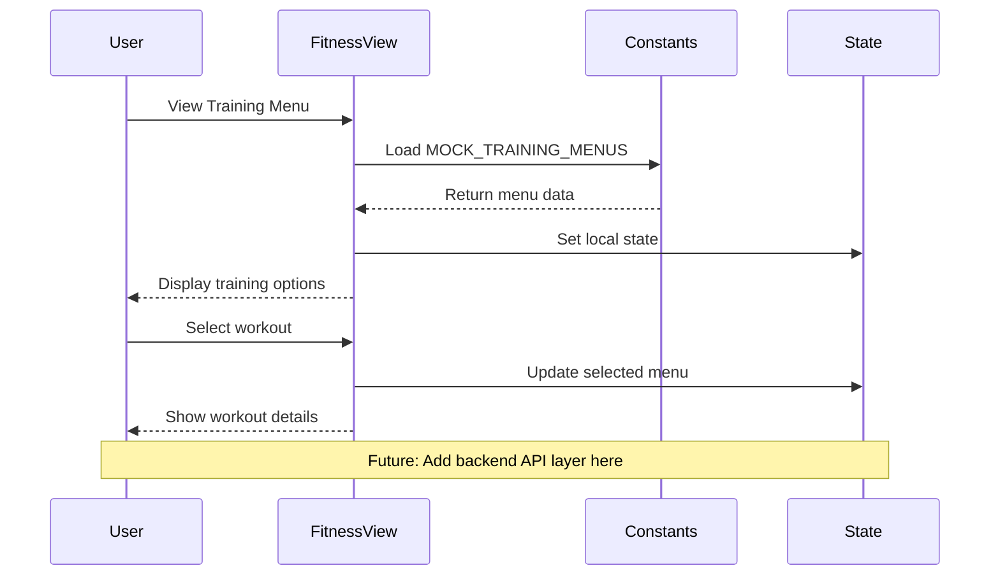

### Aero Analysis Flow

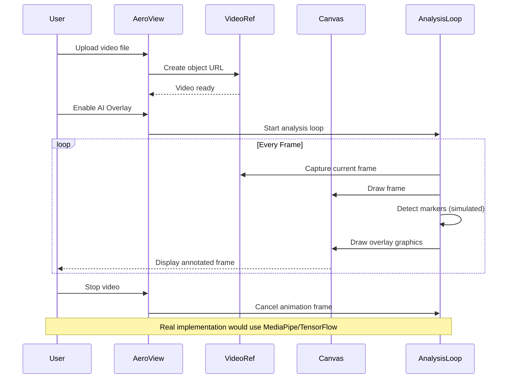

### AI Strategy Generation Flow

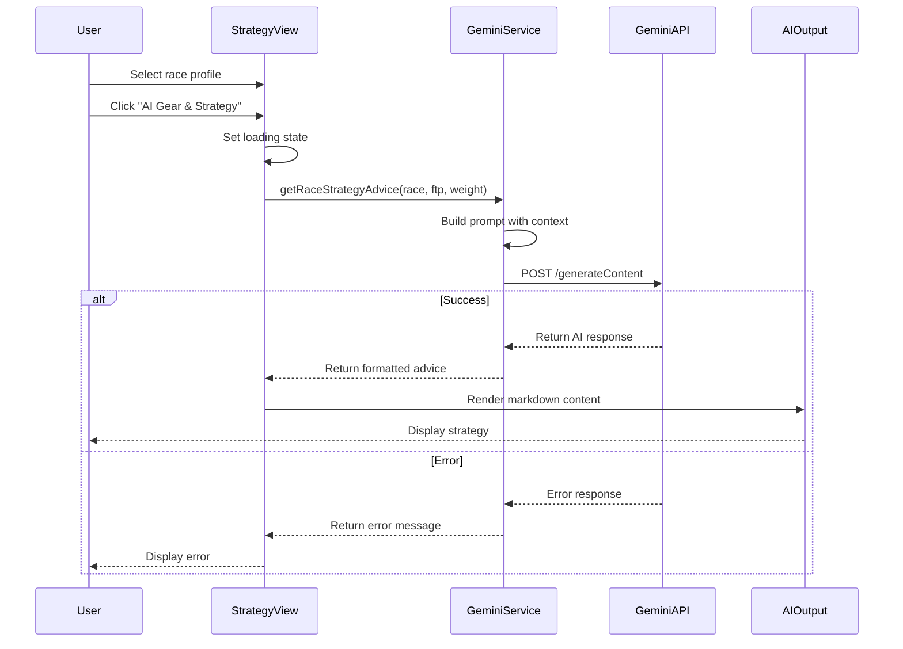

### State Management Flow

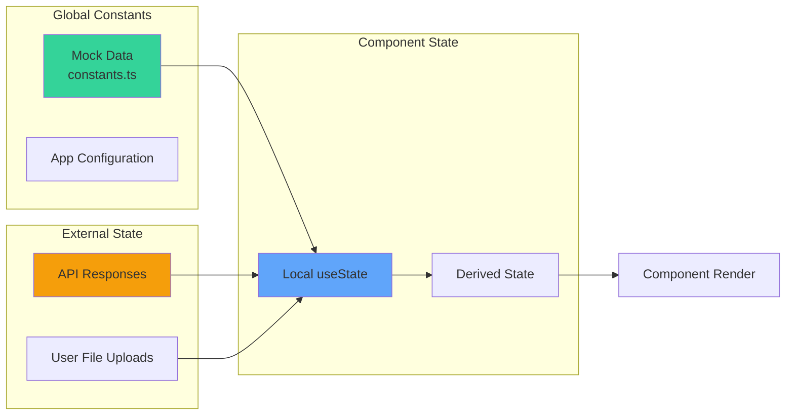

---

## Technology Stack

### Frontend Stack

```mermaid
graph TD
    subgraph "Core Framework"
        React[React 19.2.0<br/>UI Library]
        TypeScript[TypeScript 5.8.2<br/>Type Safety]
        Vite[Vite 6.2.0<br/>Build Tool]
    end
    
    subgraph "UI Libraries"
        Lucide[lucide-react<br/>Icon Library]
        Recharts[Recharts 3.5.1<br/>Charts & Graphs]
    end
    
    subgraph "AI/ML"
        GenAI[@google/genai 1.30.0<br/>Gemini Integration]
        MediaPipe[MediaPipe<br/>Future: Pose Detection]
    end
    
    subgraph "Development Tools"
        Node[Node.js 22+<br/>Runtime]
        NPM[npm<br/>Package Manager]
    end
    
    React --> Lucide
    React --> Recharts
    React --> GenAI
    TypeScript --> React
    Vite --> React
    Node --> Vite
    NPM --> Node
    
    style React fill:#61dafb
    style TypeScript fill:#3178c6
    style Vite fill:#646cff
    style GenAI fill:#4285f4
```

### Technology Choices & Rationale

| Technology | Purpose | Rationale |
|------------|---------|-----------|
| **React 19** | UI Framework | Latest features, concurrent rendering, server components ready |
| **TypeScript** | Type Safety | Catch errors early, better IDE support, self-documenting code |
| **Vite** | Build Tool | Fast HMR, optimized production builds, modern ES modules |
| **Recharts** | Data Visualization | React-friendly, customizable, responsive charts |
| **Lucide React** | Icons | Lightweight, tree-shakeable, comprehensive icon set |
| **Google Gemini** | AI Engine | State-of-the-art LLM, multimodal capabilities, generous free tier |

---

## Deployment Architecture

### Current Deployment (Static Hosting)

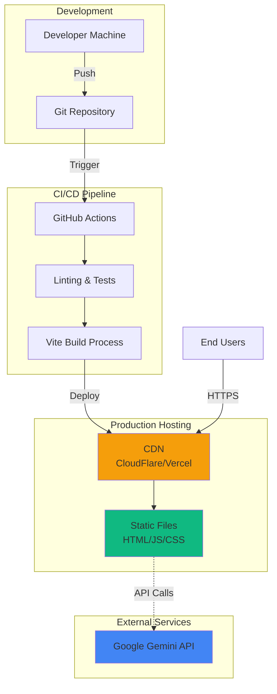

### Future Deployment (Full-Stack)

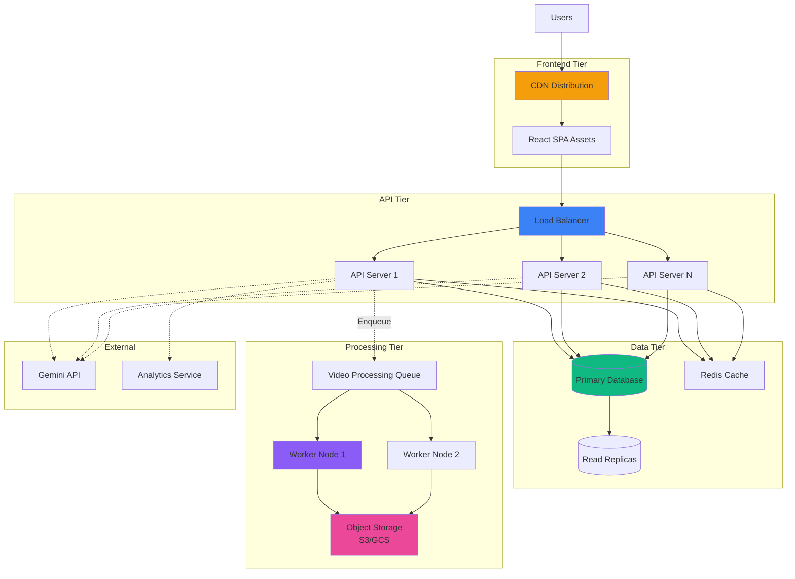

---

## Security Architecture

### Security Layers

```mermaid
graph TD
    subgraph "Application Security"
        Input[Input Validation]
        XSS[XSS Prevention]
        CORS[CORS Policy]
    end
    
    subgraph "API Security"
        Auth[JWT Authentication]
        RateLimit[Rate Limiting]
        APIKey[API Key Management]
    end
    
    subgraph "Data Security"
        Encrypt[Data Encryption]
        Privacy[Privacy Controls]
        GDPR[GDPR Compliance]
    end
    
    subgraph "Infrastructure Security"
        HTTPS[HTTPS/TLS]
        Firewall[WAF/Firewall]
        Monitoring[Security Monitoring]
    end
    
    Input --> XSS
    XSS --> CORS
    Auth --> RateLimit
    RateLimit --> APIKey
    Encrypt --> Privacy
    Privacy --> GDPR
    HTTPS --> Firewall
    Firewall --> Monitoring
    
    style Auth fill:#ef4444
    style Encrypt fill:#f59e0b
    style HTTPS fill:#10b981
```

### Security Measures

| Layer | Measure | Implementation |
|-------|---------|----------------|
| **Transport** | HTTPS/TLS | Mandatory TLS 1.3, HSTS headers |
| **Authentication** | JWT Tokens | RS256 signing, 24h expiration |
| **Authorization** | RBAC | Role-based access control per resource |
| **API Security** | Rate Limiting | 100 req/min per user, 10 req/s per IP |
| **Data Protection** | Encryption at Rest | AES-256 for sensitive data |
| **Privacy** | Data Minimization | Only collect necessary user data |
| **Secrets** | Environment Variables | API keys never in source code |
| **Input Validation** | Schema Validation | JSON Schema validation on all inputs |
| **XSS Prevention** | Content Security Policy | CSP headers, React auto-escaping |

---

## Scalability & Performance

### Performance Optimization Strategy

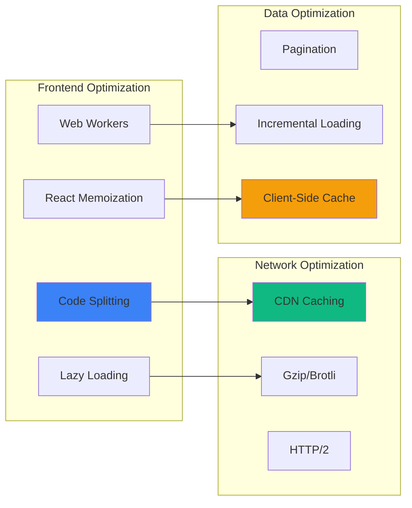

### Scalability Targets

| Metric | Current (MVP) | Target (Production) |
|--------|---------------|---------------------|
| **Concurrent Users** | 100 | 100,000 |
| **Page Load Time** | < 2s | < 1s |
| **API Response Time** | N/A | < 200ms (p95) |
| **Video Processing** | Client-side | < 5min per video |
| **Database Size** | Mock data | 1TB+ |
| **Availability** | Best effort | 99.9% |

### Horizontal Scaling Strategy

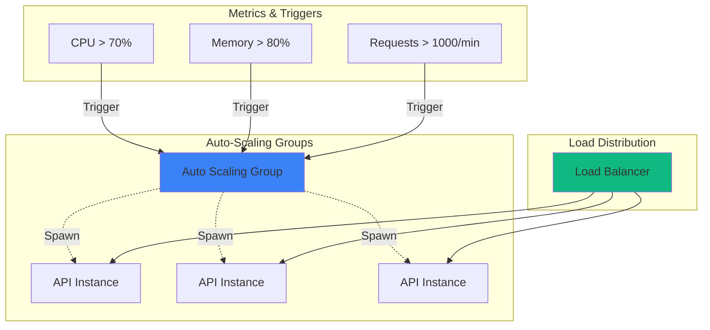

---

## Future Architecture Evolution

### Phase 2: Backend Integration

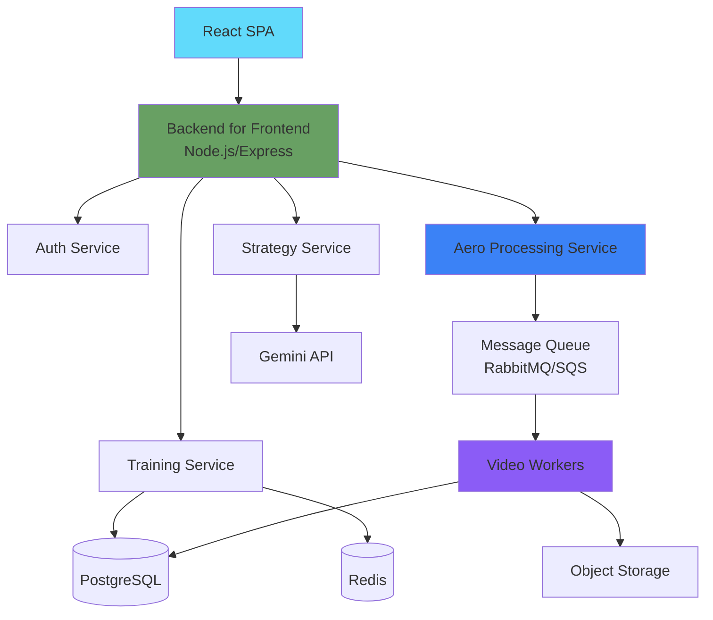

### Phase 3: Microservices Architecture

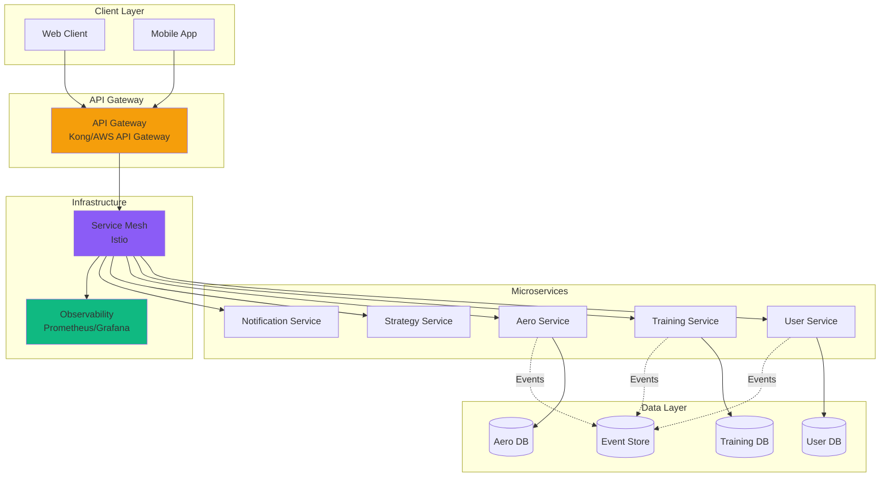

### Technology Roadmap

| Phase | Timeline | Key Technologies | Focus |
|-------|----------|------------------|-------|
| **Phase 1 (Current)** | Q4 2025 - Q1 2026 | React, Vite, Gemini | MVP, client-side prototype |
| **Phase 2** | Q2 2026 - Q3 2026 | Node.js, PostgreSQL, Redis | Backend API, data persistence |
| **Phase 3** | Q4 2026 - Q1 2027 | Kubernetes, gRPC, Event Sourcing | Microservices, scale |
| **Phase 4** | Q2 2027+ | ML Models, Real-time Processing | Advanced AI features |

---

## Design Decisions & Trade-offs

### Key Architectural Decisions

1. **Client-Side First Approach**
   - **Decision**: Build MVP entirely client-side
   - **Rationale**: Faster time to market, lower infrastructure cost
   - **Trade-off**: Limited by browser capabilities, no persistent data
   - **Mitigation**: Design for easy backend integration

2. **Direct Gemini API Integration**
   - **Decision**: Call Gemini API directly from browser
   - **Rationale**: Simplify MVP, reduce backend complexity
   - **Trade-off**: API key exposure risk, no usage control
   - **Mitigation**: Environment variables, move to backend in Phase 2

3. **Mock Data in Constants**
   - **Decision**: Store training menus and races in TypeScript constants
   - **Rationale**: No database needed for MVP
   - **Trade-off**: No user-specific data, no persistence
   - **Mitigation**: Easy migration path to database

4. **Simulated Video Analysis**
   - **Decision**: Simulate marker detection instead of real CV
   - **Rationale**: Demonstrate UX without heavy ML dependencies
   - **Trade-off**: Not production-ready analysis
   - **Mitigation**: Clear roadmap for MediaPipe integration

---

## Monitoring & Observability

### Observability Stack (Future)

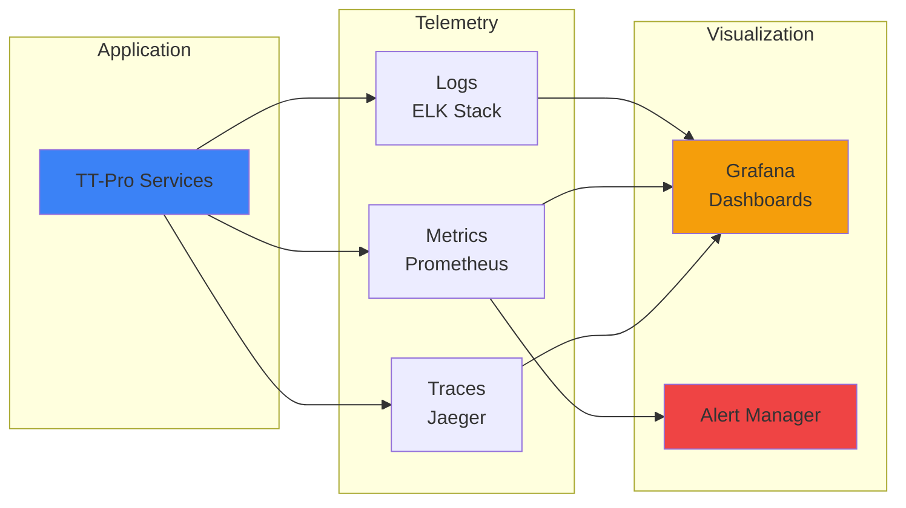

---

## Disaster Recovery & Backup

### Backup Strategy (Future)

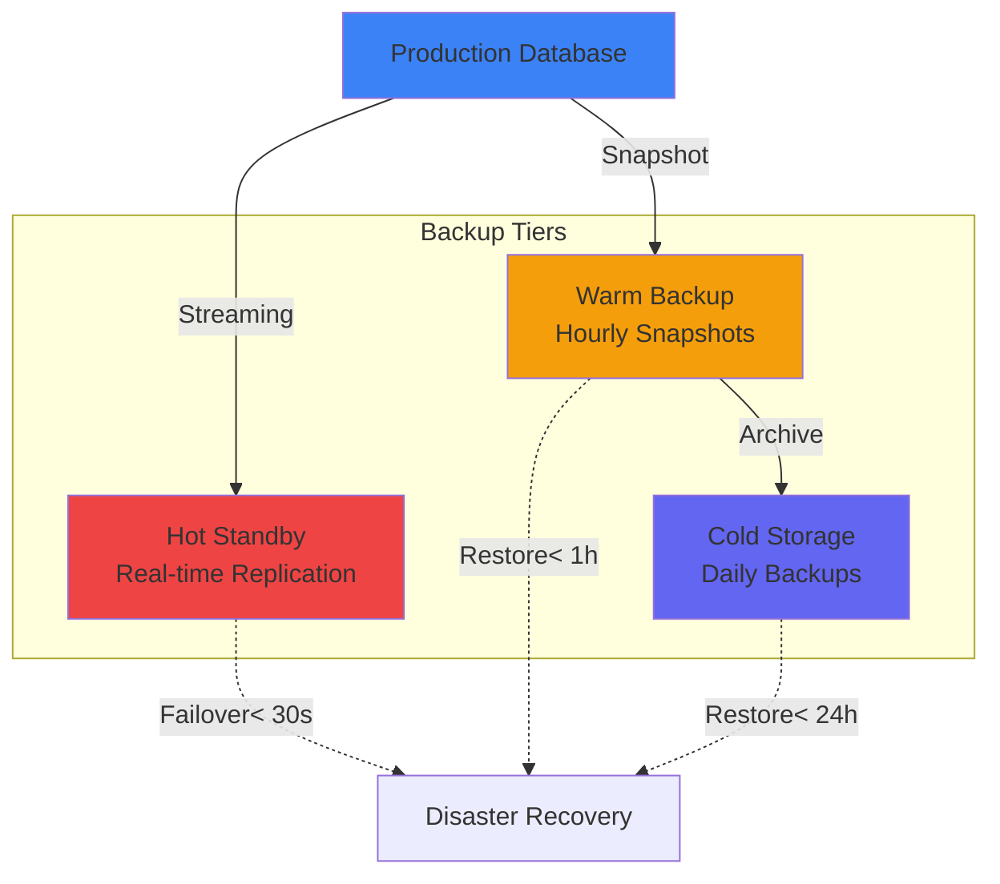

---

## Conclusion

TT-Pro's architecture is designed for:
- **Rapid prototyping** in Phase 1 (current)
- **Seamless evolution** to backend in Phase 2
- **Infinite scalability** with microservices in Phase 3
- **AI-first approach** throughout all phases

The modular design ensures each component can evolve independently while maintaining system coherence.

---

## References

- [React Documentation](https://react.dev)
- [Vite Guide](https://vitejs.dev)
- [Google Gemini API](https://ai.google.dev)
- [Mermaid Diagram Syntax](https://mermaid.js.org)
- [C4 Model](https://c4model.com)

---

**Last Updated**: 2026-01-08  
**Document Owner**: Architecture Team  
**Review Cycle**: Quarterly
