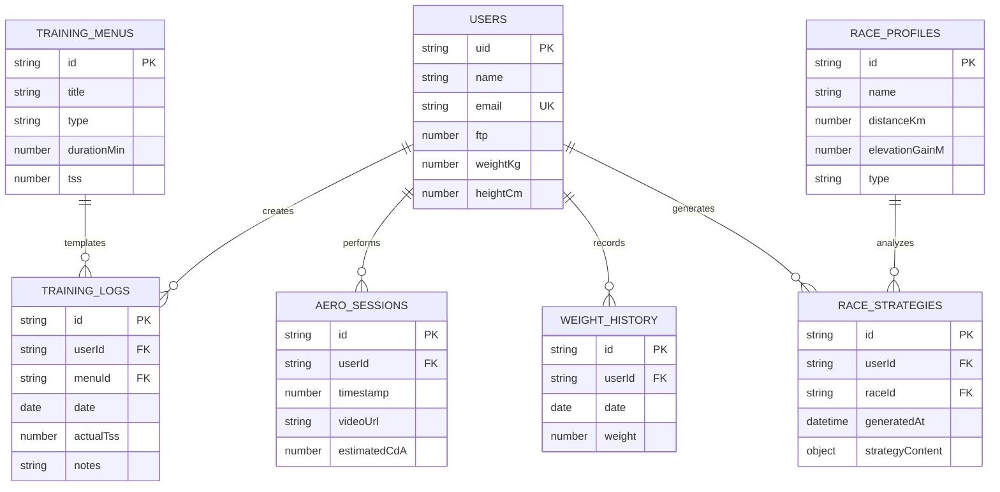

# Database Schema Definition

## Overview

TT-Pro uses a document-based data structure suitable for NoSQL databases (Firestore, MongoDB) or JSON storage in PostgreSQL. This document provides AI-readable structured schema definitions.

## Schema Version

- **Version**: 1.0.0
- **Last Updated**: 2026-01-08
- **Format**: JSON Schema

---

## Collections / Tables

### 1. Users Collection

**Collection Name**: `users`

**Description**: Stores user profile and athletic baseline data.

**Schema**:

```json
{
  "$schema": "http://json-schema.org/draft-07/schema#",
  "type": "object",
  "properties": {
    "uid": {
      "type": "string",
      "description": "Unique user identifier",
      "pattern": "^uid_[0-9]{3,}$"
    },
    "name": {
      "type": "string",
      "description": "User's full name",
      "minLength": 1,
      "maxLength": 100
    },
    "email": {
      "type": "string",
      "format": "email",
      "description": "User's email address"
    },
    "ftp": {
      "type": "number",
      "description": "Functional Threshold Power in Watts",
      "minimum": 50,
      "maximum": 600
    },
    "weightKg": {
      "type": "number",
      "description": "Current body weight in kilograms",
      "minimum": 30,
      "maximum": 200
    },
    "heightCm": {
      "type": "number",
      "description": "Height in centimeters",
      "minimum": 100,
      "maximum": 250
    },
    "createdAt": {
      "type": "string",
      "format": "date-time",
      "description": "Account creation timestamp"
    },
    "lastUpdated": {
      "type": "string",
      "format": "date-time",
      "description": "Last profile update timestamp"
    }
  },
  "required": ["uid", "name", "email", "ftp", "weightKg"]
}
```

**Example Document**:

```json
{
  "uid": "uid_001",
  "name": "Rider One",
  "email": "rider1@example.com",
  "ftp": 280,
  "weightKg": 68.5,
  "heightCm": 178,
  "createdAt": "2023-01-15T08:30:00Z",
  "lastUpdated": "2023-10-25T14:22:00Z"
}
```

---

### 2. Training Logs Collection

**Collection Name**: `training_logs`

**Description**: Records of completed training sessions.

**Schema**:

```json
{
  "$schema": "http://json-schema.org/draft-07/schema#",
  "type": "object",
  "properties": {
    "id": {
      "type": "string",
      "description": "Unique log identifier",
      "pattern": "^log_[0-9]{3,}$"
    },
    "userId": {
      "type": "string",
      "description": "Reference to user uid",
      "pattern": "^uid_[0-9]{3,}$"
    },
    "date": {
      "type": "string",
      "format": "date",
      "description": "Training date (YYYY-MM-DD)"
    },
    "menuId": {
      "type": "string",
      "description": "Reference to training menu template"
    },
    "actualDurationMin": {
      "type": "number",
      "description": "Actual duration in minutes",
      "minimum": 0
    },
    "actualTss": {
      "type": "number",
      "description": "Training Stress Score achieved",
      "minimum": 0,
      "maximum": 500
    },
    "avgPower": {
      "type": "number",
      "description": "Average power in Watts",
      "minimum": 0
    },
    "normalizedPower": {
      "type": "number",
      "description": "Normalized Power (NP) in Watts",
      "minimum": 0
    },
    "notes": {
      "type": "string",
      "description": "Free-form training notes",
      "maxLength": 1000
    },
    "createdAt": {
      "type": "string",
      "format": "date-time"
    }
  },
  "required": ["id", "userId", "date", "menuId"]
}
```

**Example Document**:

```json
{
  "id": "log_101",
  "userId": "uid_001",
  "date": "2023-10-25",
  "menuId": "menu_ftp_01",
  "actualDurationMin": 92,
  "actualTss": 82,
  "avgPower": 245,
  "normalizedPower": 268,
  "notes": "Felt strong, completed both intervals",
  "createdAt": "2023-10-25T19:45:00Z"
}
```

---

### 3. Training Menus Collection

**Collection Name**: `training_menus`

**Description**: Template workouts that users can follow.

**Schema**:

```json
{
  "$schema": "http://json-schema.org/draft-07/schema#",
  "type": "object",
  "properties": {
    "id": {
      "type": "string",
      "description": "Unique menu identifier"
    },
    "title": {
      "type": "string",
      "description": "Workout name",
      "minLength": 1,
      "maxLength": 200
    },
    "type": {
      "type": "string",
      "enum": ["FTP", "VO2Max", "Endurance", "Recovery", "Sprint"],
      "description": "Training intensity category"
    },
    "durationMin": {
      "type": "number",
      "description": "Planned duration in minutes",
      "minimum": 15,
      "maximum": 480
    },
    "tss": {
      "type": "number",
      "description": "Estimated Training Stress Score",
      "minimum": 0,
      "maximum": 500
    },
    "description": {
      "type": "string",
      "description": "Detailed workout instructions",
      "maxLength": 2000
    },
    "createdBy": {
      "type": "string",
      "description": "User ID of creator or 'system'"
    }
  },
  "required": ["id", "title", "type", "durationMin", "tss", "description"]
}
```

---

### 4. Aero Sessions Collection

**Collection Name**: `aero_sessions`

**Description**: Video analysis sessions with aerodynamic estimations.

**Schema**:

```json
{
  "$schema": "http://json-schema.org/draft-07/schema#",
  "type": "object",
  "properties": {
    "id": {
      "type": "string",
      "description": "Unique session identifier",
      "pattern": "^as_[0-9]{3,}$"
    },
    "userId": {
      "type": "string",
      "description": "Reference to user uid"
    },
    "timestamp": {
      "type": "number",
      "description": "Unix timestamp of session"
    },
    "videoUrl": {
      "type": "string",
      "format": "uri",
      "description": "Cloud storage URL for video file"
    },
    "videoMetadata": {
      "type": "object",
      "properties": {
        "durationSec": {"type": "number"},
        "fps": {"type": "number"},
        "resolution": {"type": "string"}
      }
    },
    "analysisResults": {
      "type": "object",
      "properties": {
        "estimatedCdA": {
          "type": "number",
          "description": "Coefficient of drag area in m²",
          "minimum": 0.15,
          "maximum": 0.50
        },
        "avgHipAngle": {
          "type": "number",
          "description": "Average hip angle in degrees",
          "minimum": 0,
          "maximum": 180
        },
        "positionScore": {
          "type": "number",
          "description": "Overall position quality score (0-100)",
          "minimum": 0,
          "maximum": 100
        }
      }
    },
    "frameData": {
      "type": "array",
      "description": "Per-frame analysis data",
      "items": {
        "type": "object",
        "properties": {
          "frameNumber": {"type": "number"},
          "hipAngle": {"type": "number"},
          "markerX": {"type": "number"},
          "markerY": {"type": "number"}
        }
      }
    },
    "notes": {
      "type": "string",
      "maxLength": 1000
    }
  },
  "required": ["id", "userId", "timestamp"]
}
```

**Example Document**:

```json
{
  "id": "as_552",
  "userId": "uid_001",
  "timestamp": 1698220000,
  "videoUrl": "https://storage.example.com/videos/as_552.mp4",
  "videoMetadata": {
    "durationSec": 120,
    "fps": 30,
    "resolution": "1920x1080"
  },
  "analysisResults": {
    "estimatedCdA": 0.235,
    "avgHipAngle": 45.3,
    "positionScore": 82
  },
  "frameData": [],
  "notes": "New aero bars setup"
}
```

---

### 5. Race Profiles Collection

**Collection Name**: `race_profiles`

**Description**: Race events with course characteristics.

**Schema**:

```json
{
  "$schema": "http://json-schema.org/draft-07/schema#",
  "type": "object",
  "properties": {
    "id": {
      "type": "string",
      "description": "Unique race identifier"
    },
    "name": {
      "type": "string",
      "description": "Race name",
      "minLength": 1,
      "maxLength": 200
    },
    "distanceKm": {
      "type": "number",
      "description": "Race distance in kilometers",
      "minimum": 0.1,
      "maximum": 500
    },
    "elevationGainM": {
      "type": "number",
      "description": "Total elevation gain in meters",
      "minimum": 0,
      "maximum": 10000
    },
    "type": {
      "type": "string",
      "enum": ["Flat", "Hilly", "Mountain", "TT"],
      "description": "Course profile type"
    },
    "description": {
      "type": "string",
      "description": "Course description and characteristics",
      "maxLength": 2000
    },
    "location": {
      "type": "object",
      "properties": {
        "country": {"type": "string"},
        "region": {"type": "string"},
        "coordinates": {
          "type": "object",
          "properties": {
            "lat": {"type": "number"},
            "lng": {"type": "number"}
          }
        }
      }
    },
    "dateScheduled": {
      "type": "string",
      "format": "date",
      "description": "Race date"
    }
  },
  "required": ["id", "name", "distanceKm", "elevationGainM", "type", "description"]
}
```

---

### 6. Weight History Collection

**Collection Name**: `weight_history`

**Description**: Time-series weight measurements for tracking body composition.

**Schema**:

```json
{
  "$schema": "http://json-schema.org/draft-07/schema#",
  "type": "object",
  "properties": {
    "id": {
      "type": "string",
      "description": "Unique record identifier"
    },
    "userId": {
      "type": "string",
      "description": "Reference to user uid"
    },
    "date": {
      "type": "string",
      "format": "date",
      "description": "Measurement date"
    },
    "weight": {
      "type": "number",
      "description": "Body weight in kilograms",
      "minimum": 30,
      "maximum": 200
    },
    "bodyFatPercentage": {
      "type": "number",
      "description": "Optional body fat percentage",
      "minimum": 0,
      "maximum": 100
    },
    "notes": {
      "type": "string",
      "maxLength": 500
    }
  },
  "required": ["id", "userId", "date", "weight"]
}
```

---

### 7. Race Strategies Collection

**Collection Name**: `race_strategies`

**Description**: AI-generated race strategies and recommendations.

**Schema**:

```json
{
  "$schema": "http://json-schema.org/draft-07/schema#",
  "type": "object",
  "properties": {
    "id": {
      "type": "string",
      "description": "Unique strategy identifier"
    },
    "userId": {
      "type": "string",
      "description": "Reference to user uid"
    },
    "raceId": {
      "type": "string",
      "description": "Reference to race profile"
    },
    "generatedAt": {
      "type": "string",
      "format": "date-time"
    },
    "strategyContent": {
      "type": "object",
      "properties": {
        "pacingPlan": {"type": "string"},
        "gearRecommendations": {"type": "string"},
        "nutritionPlan": {"type": "string"},
        "aeroFocus": {"type": "string"}
      }
    },
    "aiModel": {
      "type": "string",
      "description": "AI model used for generation"
    }
  },
  "required": ["id", "userId", "raceId", "generatedAt", "strategyContent"]
}
```

---

## Indexes

### Recommended Indexes for Performance

```json
{
  "indexes": [
    {
      "collection": "training_logs",
      "fields": [{"userId": 1}, {"date": -1}],
      "description": "Query user's training logs by date"
    },
    {
      "collection": "aero_sessions",
      "fields": [{"userId": 1}, {"timestamp": -1}],
      "description": "Query user's aero sessions chronologically"
    },
    {
      "collection": "weight_history",
      "fields": [{"userId": 1}, {"date": -1}],
      "description": "Query user's weight history by date"
    },
    {
      "collection": "users",
      "fields": [{"email": 1}],
      "unique": true,
      "description": "Ensure unique email addresses"
    }
  ]
}
```

---

## Relationships

### Entity Relationship Diagram (Mermaid)



---

## Data Migration Notes

### From Initial Mock Data to Production

The application currently uses mock data defined in `constants.ts`. To migrate to a production database:

1. **Export Mock Data**: Extract `MOCK_TRAINING_MENUS`, `MOCK_RACES`, `MOCK_WEIGHT_HISTORY`
2. **Transform to Schema**: Convert to proper schema format with unique IDs
3. **Seed Database**: Use database seeding scripts to populate initial data
4. **Update Services**: Modify service layer to use database queries instead of constants

### Example Migration Script (Conceptual)

```javascript
// migrate-mock-data.js
const mockMenus = require('./constants').MOCK_TRAINING_MENUS;

async function migrateTrainingMenus(db) {
  const collection = db.collection('training_menus');
  
  for (const menu of mockMenus) {
    await collection.insertOne({
      ...menu,
      createdBy: 'system',
      createdAt: new Date().toISOString()
    });
  }
}
```

---

## Database Selection Recommendations

### Option 1: Firestore (Recommended for MVP)

**Pros**:
- Real-time synchronization
- Offline support
- Automatic scaling
- Google ecosystem integration (Gemini API)

**Cons**:
- Complex query limitations
- Cost at scale

### Option 2: MongoDB Atlas

**Pros**:
- Flexible schema
- Powerful aggregation
- Full-text search

**Cons**:
- Requires more configuration
- Self-managed scaling

### Option 3: PostgreSQL with JSONB

**Pros**:
- ACID compliance
- Mature ecosystem
- Flexible JSONB for document storage

**Cons**:
- More complex schema migrations
- Less real-time support

---

## Change Log

| Version | Date | Changes |
|---------|------|---------|
| 1.0.0 | 2026-01-08 | Initial schema definition |

---

## Notes

- All timestamps use ISO 8601 format
- All weights in kilograms (kg)
- All distances in kilometers (km)
- All elevations in meters (m)
- Power measurements in Watts (W)
