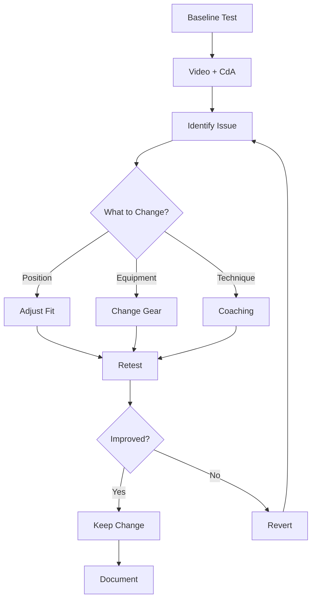

# Operations Manual

## Overview

This operations manual provides comprehensive instructions for using TT-Pro, covering all features and workflows for athletes, coaches, and power users.

**Target Audience**: End users, athletes, coaches  
**Version**: 1.0.0  
**Last Updated**: 2026-01-08

---

## Table of Contents

1. [Getting Started](#getting-started)
2. [Fitness Module](#fitness-module)
3. [Aero Analysis Module](#aero-analysis-module)
4. [Strategy Module](#strategy-module)
5. [Documentation Module](#documentation-module)
6. [Workflows & Best Practices](#workflows--best-practices)
7. [Tips & Tricks](#tips--tricks)
8. [Troubleshooting](#troubleshooting)

---

## Getting Started

### Accessing TT-Pro

1. **Open Application**
   - Navigate to the application URL (e.g., `https://tt-pro.example.com`)
   - Or run locally: `npm run dev` and open `http://localhost:5173`

2. **Interface Overview**
   ```
   ┌─────────────────────────────────────────┐
   │  TT-Pro           [Fitness] [Aero] ... │  ← Navigation Bar
   ├─────────────────────────────────────────┤
   │                                         │
   │         Main Content Area               │
   │                                         │
   │                                         │
   └─────────────────────────────────────────┘
   ```

3. **Navigation**
   - Click tabs in the navigation bar to switch between modules
   - Available modules:
     - 🎯 **Fitness**: Training and fitness tracking
     - ✈️ **Aero**: Aerodynamic analysis
     - 📊 **Strategy**: Race planning and AI advice
     - 📚 **Docs**: Technical documentation

---

## Fitness Module

### Overview

The Fitness module helps you manage training load, track weight, and plan workouts.

**Key Features**:
- FTP (Functional Threshold Power) tracking
- Weight progression charts
- Training library with pre-built workouts
- TSS (Training Stress Score) calculation

### Using the Fitness Module

#### 1. View Your Stats

**Current FTP Display**:
- Located at top-left of dashboard
- Shows current FTP in Watts
- Displays trend compared to last month

**Weight Tracking**:
- Middle card shows current weight in kg
- Displays power-to-weight ratio (W/kg)

**Next Race Info**:
- Right card shows upcoming race
- Days remaining until race

#### 2. Weight Progression Chart

**Purpose**: Track weight changes over time for optimal power-to-weight ratio

**How to Read**:
- X-axis: Date (chronological)
- Y-axis: Weight in kilograms
- Blue area chart: Weight trend
- Hover over points to see exact values

**Best Practices**:
- Weigh yourself at the same time each day (morning, after bathroom)
- Track weekly averages rather than daily fluctuations
- Aim for gradual changes (0.25-0.5 kg/week max)

**Feature ID**: F-1-3 (Weight Progression Chart)

#### 3. Training Library

**Purpose**: Browse and select structured workouts

**Available Workout Types**:

| Type | Description | Typical Duration | TSS Range |
|------|-------------|------------------|-----------|
| **FTP** | Threshold intervals | 60-120 min | 70-100 |
| **VO2Max** | High-intensity intervals | 45-75 min | 60-90 |
| **Endurance** | Long steady rides | 120-300 min | 100-200 |
| **Recovery** | Easy spinning | 30-60 min | 20-40 |

**How to Use**:
1. Scroll through training library
2. Read workout descriptions
3. Note duration and TSS for planning
4. Click calendar icon to schedule (future feature)

**Example Workouts**:

```
2x20min FTP Intervals
├─ Type: FTP
├─ Duration: 90 minutes
├─ TSS: 85
└─ Description: Classic threshold work. Warm up 20m, 
   2x20m at 100% FTP with 5m rest, Cool down.

VO2Max Micro-bursts
├─ Type: VO2Max
├─ Duration: 60 minutes
├─ TSS: 75
└─ Description: 3 sets of 10x(30s ON / 15s OFF) 
   at 120% FTP.

LSD Base Miles
├─ Type: Endurance
├─ Duration: 180 minutes
├─ TSS: 150
└─ Description: Long slow distance at Zone 2 
   (65-75% FTP).
```

**Feature ID**: F-1-1 (Training Menu Selection)

#### 4. Creating a Training Plan

**Weekly TSS Guidelines**:
- **Beginner**: 200-400 TSS/week
- **Intermediate**: 400-600 TSS/week
- **Advanced**: 600-800+ TSS/week

**Sample Week Structure**:
```
Monday:    Recovery Ride (30 TSS)
Tuesday:   VO2Max Session (75 TSS)
Wednesday: Endurance Ride (120 TSS)
Thursday:  FTP Intervals (85 TSS)
Friday:    Recovery Ride (30 TSS)
Saturday:  Long Ride (150 TSS)
Sunday:    Rest
────────────────────────────────
Total:     490 TSS
```

---

## Aero Analysis Module

### Overview

The Aero module provides video analysis and aerodynamic efficiency calculation tools.

**Key Features**:
- Video upload and playback
- AI-powered position analysis (simulated in MVP)
- Virtual CdA (Coefficient of drag × area) calculator
- Hip angle tracking

### Using the Aero Module

#### 1. Video Analysis

**Feature ID**: F-2-1 (Video Upload), F-2-2 (Video Playback)

**Step-by-Step Guide**:

1. **Record Your Video**
   - Use side-view camera angle
   - 30+ seconds of steady riding
   - Good lighting conditions
   - Markers on hip/knee (optional but helpful)
   - Recommended resolution: 1080p or higher

2. **Upload Video**
   - Click "Upload Side-View Video" button
   - Select video file (.mp4, .mov supported)
   - Video loads in player

3. **Enable AI Overlay**
   - Click "AI Overlay On" button
   - Play video
   - Watch blue markers track hip and knee positions
   - Hip angle displayed in top-left

4. **Interpret Results**
   - **Hip Angle**: Optimal range 40-50° for time trial position
   - **Vertical Oscillation**: Less movement = more efficient
   - **Position Consistency**: Steady angles indicate good stability

**Feature ID**: F-2-3 (Marker Detection and Hip Angle)

**Position Guidelines**:

| Hip Angle | Position Type | Aerodynamics | Comfort | Power Output |
|-----------|---------------|--------------|---------|--------------|
| 30-40° | Aggressive TT | Excellent | Low | Reduced |
| 40-50° | Standard TT | Good | Medium | Good |
| 50-60° | Relaxed TT | Fair | High | Excellent |
| 60°+ | Road Position | Poor | Excellent | Excellent |

**Best Setup**: Balance between aero (low angle) and power (higher angle)

#### 2. Virtual CdA Calculator

**Feature ID**: F-2-4 (CdA Calculation)

**Purpose**: Estimate your aerodynamic drag coefficient from field data

**Required Inputs**:

| Parameter | Description | Typical Range | Example |
|-----------|-------------|---------------|---------|
| **Avg Power** | Normalized power for segment | 200-400 W | 300 W |
| **Speed** | Average speed | 30-50 km/h | 40 km/h |
| **Crr** | Coefficient of rolling resistance | 0.003-0.006 | 0.004 |
| **Air Density** | Atmospheric density | 1.15-1.25 kg/m³ | 1.225 kg/m³ |

**How to Use**:

1. **Collect Field Data**
   - Ride steady 5-10 minute effort on flat road
   - Record average power and speed
   - Note conditions (temperature, elevation)

2. **Enter Values**
   - Input power, speed, Crr, air density
   - Click "Calculate" button

3. **Read Result**
   - Estimated CdA displayed in m²
   - Lower is better (more aerodynamic)

**CdA Benchmarks**:

```
Position          CdA (m²)    Speed @ 300W
─────────────────────────────────────────
Hoods             0.350       35.2 km/h
Drops             0.300       37.8 km/h
Base Bar (TT)     0.260       40.2 km/h
Aero Bars         0.240       41.3 km/h
Optimal TT        0.220       42.8 km/h
Supertuck (UCI)   0.200       44.1 km/h
```

**Calculation Formula**:

```
CdA = (Power - Crr × Mass × g × Velocity) / (0.5 × ρ × v³)

Where:
- Power: Average power (W)
- Crr: Rolling resistance coefficient
- Mass: Rider + bike weight (kg)
- g: Gravity (9.81 m/s²)
- ρ: Air density (kg/m³)
- v: Velocity (m/s)
```

**Important Notes**:
- ⚠️ Assumes flat terrain (0% gradient)
- ⚠️ Assumes no wind
- ⚠️ For accurate results, use Chung Method or velodrome testing
- Use this as a relative comparison tool, not absolute measurement

#### 3. Aero Testing Protocol

**Recommended Workflow**:

1. **Baseline Test**
   - Record video in current position
   - Calculate CdA with current setup
   - Note hip angle and position

2. **Make Adjustment**
   - Change one variable (e.g., bar height, helmet, clothing)
   - Keep everything else constant

3. **Comparison Test**
   - Record new video
   - Recalculate CdA
   - Compare results

4. **Iterate**
   - Keep improvements
   - Discard changes that worsen aerodynamics or comfort

**Sample Test Log**:

```
Test 1 - Baseline
├─ Setup: Standard road bars, normal helmet
├─ CdA: 0.285 m²
├─ Hip Angle: 52°
└─ Speed @ 300W: 39.1 km/h

Test 2 - Aero Helmet
├─ Setup: Aero helmet added
├─ CdA: 0.272 m² (↓ 4.6%)
├─ Hip Angle: 52°
└─ Speed @ 300W: 39.9 km/h (↑ 0.8 km/h)

Test 3 - Lower Position
├─ Setup: Bars lowered 2cm
├─ CdA: 0.258 m² (↓ 5.1%)
├─ Hip Angle: 47°
└─ Speed @ 300W: 40.8 km/h (↑ 0.9 km/h)
```

---

## Strategy Module

### Overview

The Strategy module uses AI (Google Gemini) to generate personalized race strategies and training plans.

**Key Features**:
- Race profile library
- AI-powered gear recommendations
- Pacing strategies
- Race-specific workout generation

### Using the Strategy Module

#### 1. Selecting a Race

**Step-by-Step**:

1. **Browse Race Library** (left sidebar)
   - Mt. Fuji Hillclimb (Mountain)
   - Tokyo Bay Time Trial (Flat TT)
   - Suzuka Enduro (Hilly)

2. **View Race Details**
   - Distance in kilometers
   - Elevation gain in meters
   - Course type and description

3. **Click Race Card** to select

**Race Profile Information**:

```
Mt. Fuji Hillclimb
├─ Distance: 24 km
├─ Elevation: 1,255 m
├─ Type: Mountain
├─ Avg Gradient: 5.2%
└─ Description: Constant gradient, W/kg matters 
   more than aerodynamics

Tokyo Bay Time Trial
├─ Distance: 40 km
├─ Elevation: 50 m
├─ Type: TT
├─ Avg Gradient: 0.1%
└─ Description: Dead flat, pure aero vs power battle

Suzuka Enduro
├─ Distance: 120 km
├─ Elevation: 800 m
├─ Type: Hilly
├─ Avg Gradient: 0.7%
└─ Description: Technical corners with punchy climbs
```

#### 2. AI Gear & Strategy

**Feature ID**: F-3-1 (AI Race Strategy Generation)

**Purpose**: Get AI-generated race plan based on your fitness and course profile

**How to Use**:

1. Click "AI Gear & Strategy" button
2. Wait 5-15 seconds for AI generation
3. Review AI recommendations

**Output Includes**:

- **Pacing Strategy**: Specific wattage targets for race sections
- **Gear Recommendations**: Wheels, tires, gearing, clothing
- **Nutrition Plan**: Carbohydrate intake recommendations
- **Aero Focus**: Where to prioritize position vs. power

**Example Output**:

```markdown
## Pacing Strategy
- First 8km (0-25%): 240-250W (conservative start)
- Middle 12km (25-75%): 265-275W (steady threshold)
- Final 4km (75-100%): 280-290W (finish strong)

## Gear Recommendation
- Wheels: Medium depth (50-60mm) for hill/wind balance
- Tires: 25mm tubeless at 75-80 PSI
- Gearing: 52/36 with 11-30 cassette
- Clothing: Aero jersey, standard shorts (comfort priority)

## Nutrition
- 60g carbs/hour (3 gels + sports drink)
- Gel every 20 minutes
- Hydration: 500ml/hour

## Aero Focus
- Maintain baseline position on grades < 6%
- Sit up on steep sections (> 8%) for breathing
- Prioritize steady power over aggressive position
```

#### 3. AI Race-Specific Workout

**Feature ID**: F-3-2 (Race-Specific Workout Generation)

**Purpose**: Generate training workout that simulates race demands

**How to Use**:

1. Click "AI Race-Spec Workout" button
2. Wait for AI generation
3. Review and copy workout to training plan

**Example Output**:

```markdown
## Workout Name
Mt. Fuji Hillclimb Simulation

## Total Duration
2 hours 15 minutes

## Warmup
20 minutes progressive from Zone 1 to Zone 2

## Main Set
4x 10 minutes at 95% FTP (5% gradient simulation)
with 5 minutes recovery between intervals

Focus: Simulate sustained climbing at race intensity

## Cooldown
15 minutes easy spinning in Zone 1

## Why This Works
Replicates the sustained power demands and duration 
of Mt. Fuji climb while building specific strength 
and mental toughness for long climbs.
```

#### 4. Interpreting AI Advice

**Tips for Using AI Recommendations**:

✅ **Do**:
- Use as starting point for planning
- Adjust based on personal experience
- Test strategies in training first
- Combine AI advice with coach input

❌ **Don't**:
- Follow blindly without testing
- Ignore your own body signals
- Drastically change proven approaches
- Rely solely on AI for race day decisions

**AI Limitations**:
- Doesn't know your complete training history
- Can't account for weather on race day
- Doesn't consider your specific weaknesses/strengths
- Based on general population data

---

## Documentation Module

### Overview

Access technical documentation, architecture diagrams, and developer resources.

**Available Documentation**:
- System architecture with Mermaid diagrams
- Database schema definitions
- Video analysis algorithms
- Development guides

**How to Use**:
1. Click "Docs" tab in navigation
2. Scroll through documentation
3. Reference for technical understanding

---

## Workflows & Best Practices

### Workflow 1: Pre-Race Preparation


**Timeline**:
- **12 weeks out**: Select target race
- **8-10 weeks out**: Generate and begin race-specific workouts
- **4-6 weeks out**: Test aero setup and equipment
- **2-3 weeks out**: Finalize pacing and nutrition strategy
- **1 week out**: Taper and final preparation
- **Race day**: Execute plan

### Workflow 2: Aero Optimization



### Workflow 3: Training Progression

**Phase 1: Base Building (8-12 weeks)**
- Focus: Endurance workouts
- Weekly TSS: 400-500
- Intensity: 80% Zone 2, 20% threshold

**Phase 2: Build (6-8 weeks)**
- Focus: FTP and VO2Max intervals
- Weekly TSS: 500-600
- Intensity: 60% Zone 2, 30% threshold, 10% VO2Max

**Phase 3: Specialization (4-6 weeks)**
- Focus: Race-specific workouts
- Weekly TSS: 600-700
- Intensity: Match race demands

**Phase 4: Taper (1-2 weeks)**
- Focus: Recovery and sharpening
- Weekly TSS: 200-300
- Intensity: Short, high-quality efforts

---

## Tips & Tricks

### Fitness Module Tips

1. **Weight Tracking**
   - Take 7-day rolling average
   - Don't panic over daily fluctuations
   - Focus on long-term trend

2. **TSS Management**
   - Build gradually (increase 10% per week max)
   - Include recovery weeks every 3-4 weeks
   - Listen to fatigue signals

### Aero Module Tips

1. **Video Recording**
   - Use tripod for stability
   - Record from exact side view (90° angle)
   - Include full pedal stroke in frame
   - Good lighting is crucial

2. **CdA Testing**
   - Test on same road segment
   - Similar weather conditions
   - Flat terrain only
   - Use power meter for accuracy

### Strategy Module Tips

1. **AI Prompts**
   - More specific race details = better advice
   - Include your strengths/weaknesses in description
   - Generate multiple strategies and compare

2. **Race Planning**
   - Have Plan A, B, and C
   - Practice nutrition strategy in training
   - Test equipment before race day

---

## Troubleshooting

### Common Issues

**Issue**: Video won't upload
- Check file format (.mp4, .mov only)
- Reduce file size if > 100MB
- Try different browser

**Issue**: AI doesn't generate strategy
- Verify API key is configured
- Check internet connection
- Try again after 30 seconds

**Issue**: Charts not displaying
- Refresh page
- Clear browser cache
- Check browser console for errors

**Issue**: CdA calculation shows "Invalid Params"
- Ensure power > rolling resistance power
- Check all fields have numeric values
- Speed must be > 0

---

## Glossary

| Term | Definition |
|------|------------|
| **FTP** | Functional Threshold Power - max power sustainable for 1 hour |
| **TSS** | Training Stress Score - workout difficulty metric (0-500+) |
| **CdA** | Coefficient of drag × frontal area (m²) - lower is more aero |
| **W/kg** | Watts per kilogram - power-to-weight ratio |
| **NP** | Normalized Power - adjusted average power accounting for variability |
| **Crr** | Coefficient of rolling resistance - tire friction factor |

---

## Appendix: Keyboard Shortcuts

| Shortcut | Action |
|----------|--------|
| `1` | Switch to Fitness view |
| `2` | Switch to Aero view |
| `3` | Switch to Strategy view |
| `4` | Switch to Docs view |
| `Space` | Play/Pause video (when in Aero view) |
| `Esc` | Close overlay/modal |

---

**Last Updated**: 2026-01-08  
**Document Version**: 1.0.0  
**Feedback**: Please report issues or suggestions
